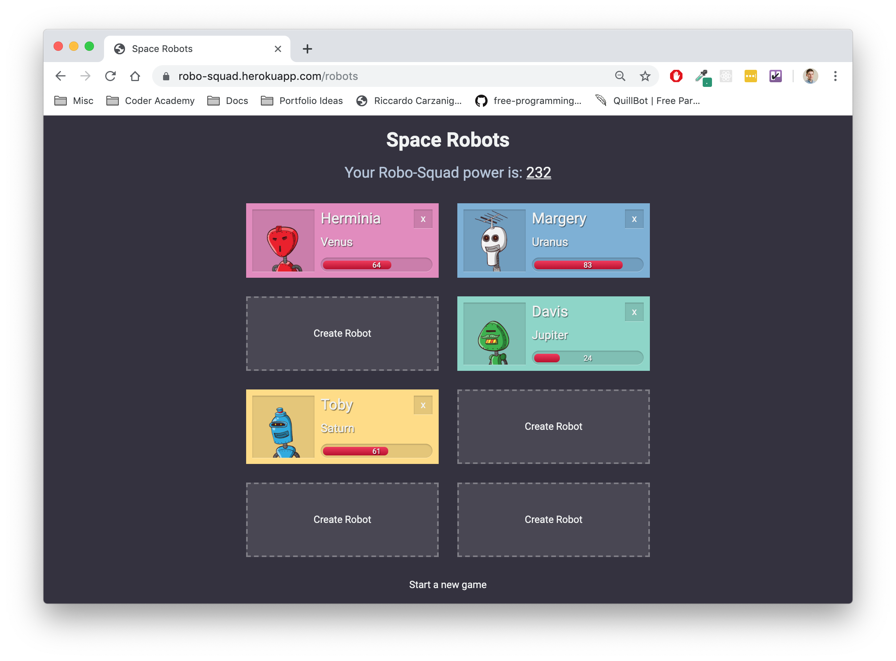

# README

Live: [https://robo-squad.herokuapp.com/robots](https://robo-squad.herokuapp.com/robots)

Repo: [github.com/ironest/robot-game](https://github.com/ironest/robot-game)

Contributors: [Riccardo Carzaniga](https://github.com/ironest)

## Description

Robo-Squad is a single-page game where the player is requested to create a team of 8 robots. Each robot is randomly generated and has two main properties: Planet of origin (Mercury, Venus, Earth, Jupiter, Saturn, Uranus, Neptune) and a Power Level (randomly assigned as a number between 1 and 100).
The player is challenged to create a team with robots from 8 different plant and, at the same time, trying to score the highest score (calculated as the sum of each robot's power level).

## Screenshot

## Prerequisites

* Ruby version 2.6.3

* Rails

* No database required as the project has been generated with -O option, (--skip-active-record)

* No test suite at this stage
